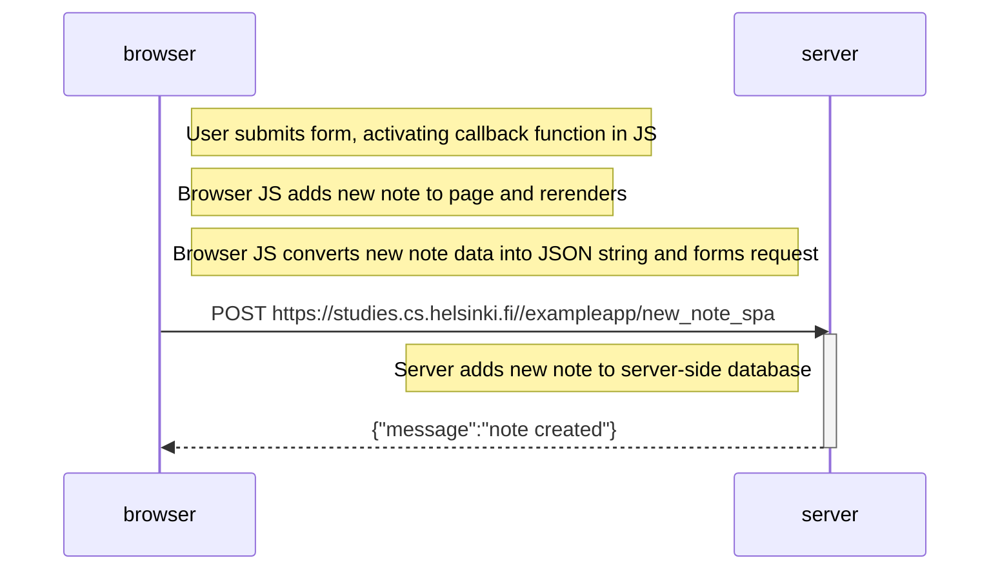

```mermaid
  sequenceDiagram
    participant browser
    participant server

    Note right of browser: User submits form, activating callback function in JS
    Note right of browser: Browser JS adds new note to page and rerenders
    Note right of browser: Browser JS converts new note data into JSON string and forms request
    browser->>server: POST https://studies.cs.helsinki.fi//exampleapp/new_note_spa
    activate server
    Note left of server: Server adds new note to server-side database
    server-->>browser: {"message":"note created"}
    deactivate server
```